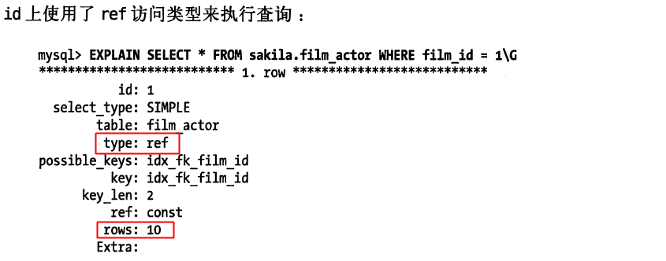
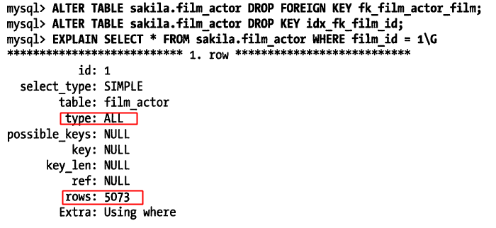
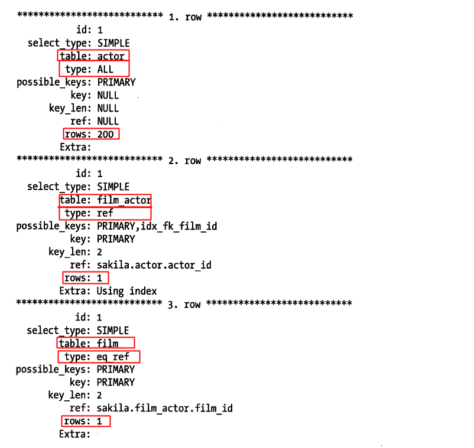
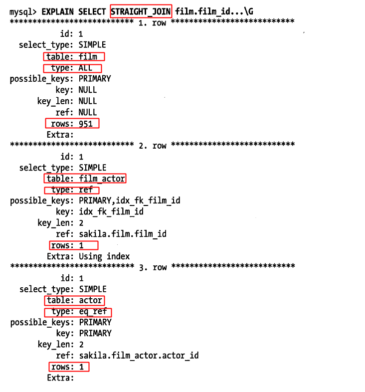
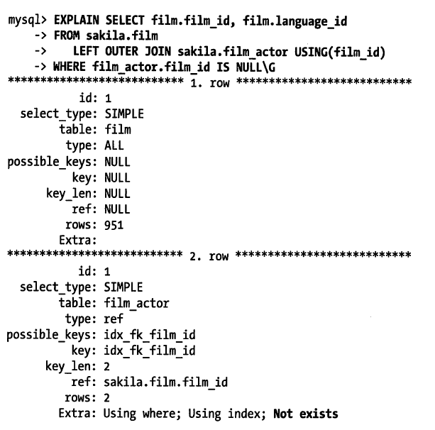
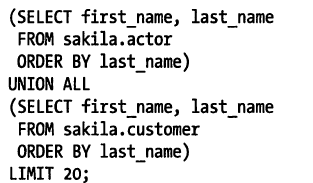
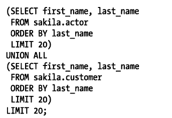
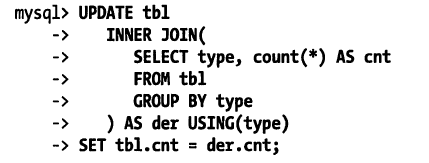

### 第六章 查询性能优化
#### 6.1 为什么查询速度会变慢
影响查询速度真正重要的是响应时间。查询花费的响应时间体现在不同的地方，包括网络，CPU计算，生成统计信息和执行计划、锁等待（互斥等待）等操作，尤其是向底层存储引擎检索数据的调用操作，这些调用需要在内存操作、CPU操作和内存不足时导致的I/O操作上消耗时间。根据存储引擎不同，可能还会产生大量的上下文切换以及系统调用。 
优化查询的目的是减少和消除一些不必要的额外操作、某些操作被额外地重复了很多次、某些操作执行得太慢等这些操作所花费的时间。

#### 6.2 慢查询基础：优化数据访问
查询性能低下最基本的原因是访问的数据太多。大部分性能低下的查询都可以通过减少访问的数据量的方式进行优化。对于低效的查询，可以从下面两个步骤来分析：
（1）确认应用程序是否在检索大量超过需要的行，这通常意味着访问了太多的行，但有时候也有可能访问了太多的列。
（2）确认Mysql服务器层是否在分析大量超过需要的数据行。

一些典型的情况：
（1）查询不需要的记录。这样的查询上应该加上LIMIT（错误做法：先使用SELECT语句查询大量的结果，然后获取前面的N行后关闭结果集）
（2）多表关联时返回了全部列。应该只取需要的列。（错误做法：
 
正确做法：

）
（3）总是取出全部的列：SELECT *；（另外用途：如果应用程序有缓存机制的话，可以考虑）
（4）重复查询需要的数据。较好的解决方案是使用数据缓存。

确认MySQL只返回了需要的数据之后，接下来应该看看查询是否扫描了过多的数据，最简单的衡量查询开销的三个指标如下：
（1）响应时间
（2）扫描的行数
（3）返回的行数

**响应时间**
响应时间=排队时间+服务时间

**扫描的行数和返回的行数**
分析查询时，查看该查询扫描的行数，在一定程度上能够说明该查询找到需要的数据的效率高不高。
理性情况下的扫描的行数和返回的行数应该是相等的。关联查询时，需要扫描多行才能生成结果集中的一行。

**扫描的行数和访问类型**
在评估查询开销的时候，需要考虑一下从表中找到某一行数据的成本。MySQL有好几种方式可以查找并返回一行结果，Explain的type列反应了访问类型，访问类型有全表扫描、索引扫描、范围扫描、唯一索引查询、常数引用等，这些速度从慢到块，扫描的行数从大到小。索引让mysql以最高效、扫描行数最少的方式找到需要的记录。

&gt;例子：

EXPLAIN的结果显示Mysql预估需要访问10行数据
没有索引的情况下，删除对应的索引再来运行这个查询

访问类型变成了一个全表扫描（ALL）,预估需要扫描5073条记录。

Using Where表示MySQL将通过Where条件来筛选存储引擎返回的数据。MySQL能够以三种方式应用Where条件，从好到坏依次是：
（1）在索引中使用Where来过滤数据，这是在存储引擎层实现的
（2）使用了索引覆盖扫描（Extra列中Using index）来返回记录，直接从索引中过滤不需要的记录并返回命中的结果，这是在MySQL服务器层实现的，但是无需回表查询记录。
（3）从数据表中返回数据，然后过滤不满足条件的记录，这是在MySQL服务器层实现的，MySQL需要先从数据库中读取记录然后过滤。

如果一个查询需要扫描大量的数据但是只返回少数的行，那么通常可以尝试下面的技巧去优化：
（1）使用索引覆盖扫描，即把所有需要的列都放到索引中，这样存储引擎无需回表获取对应行就可以返回结果了。
（2）改变表库表结构，使用单独的汇总表。
（3）重写整个复杂的查询，让MySQL优化器能够以最优化的方式执行整个查询。

### 6.3、重构查询的方式。
#### 6.3.1 确定一个复杂查询还是多个简单查询更加有效
#### 6.3.2 切分查询：将一个完整的查询分散到多次小查询中（例如通过Limit）
将原本一次性的压力分散到一个很长的时间段中，可以大大降低对服务器的影响，还可以大大减少删除时锁持有时间。
#### 6.3.3 分解关联查询
很多高性能的应用都会对关联查询进行分解。简单做法，对每一个表进行一次单表查询，然后将结果在应用程序中进行关联。例如：

可以分解成下面这些查询来代替：

用分解关联查询的方式重构查询的优势：
（1）让缓存的效率更高。
（2）执行单个查询可以减少锁的竞争。
（3）对数据库容易拆分，容易做到高性能和可扩展。 
（4）可以减少冗余记录的查询

### 6.4、查询执行的基础
MySQL执行查询的过程：
（1）客户端发送一条查询给服务器
（2）服务器先检查查询缓存，如果命中了缓存，则立即返回存储在缓存中的结果，否则进入下一个阶段。
（3）服务器端进行SQL解析、预处理，再由优化器生成对应的执行计划
（4）将结果返回给客户端。

#### 6.4.1 MySQL客户端、服务器端通信协议：
MySQL客户端和服务器端的通信协议是“半双工”的，在任何一个时刻，要么是服务器向客户端发送数据，要么是由客户端向服务器发送数据，这两个动作不能同时发生。

当使用多数连接Mysql的库函数从Mysql中获取数据的时候，其结果看起来都像是从MySQL服务器获取数据，实际上都是从这个库函数的缓存中获取数据。多数情况下，这没有什么问题，但是如果需要返回一个很大的数据集的时候，这样做并不好，因为库函数会花费很多时间和内存来存储所有的结果集，如果能够尽早处理这些结果集，就能大大减少内存的消耗，这种情况下可以不适用缓存来处理记录结果而是直接处理，这样做的缺点是，对于服务器来说，需要查询完成之后才能释放资源，所以在和客户端交互的过程中，服务器的资源都是被这个查询所占用的。
<code>
$link= mysql_connect('', '', '')
$result= mysql_query("SELECT * FROM table", $link);
while($row = mysql_fetch_array( $result ) ){//dosomething}
</code>

这段代码看起来像是当你需要的时候，才循环从服务器端取出数据，而实际上，在上面的代码中，在调用mysql_query()的时候，PHP就已经将整个结果集缓存到内存中了，而while循环仅仅是从这个缓存中逐行读取数据。如果用Mysql_unbuffed_query代替mysql_query，则不会缓存结果。

查询状态：
对于一个MySQL连接（一个线程），任何时刻都有一个状态，该状态表示了MySQL当前正在做什么。可以用Show (full) processlist查询。
Sleep : 线程正在等待客户端发送新的请求
Query: 线程正在执行查询或者将结果发送给客户端
Locked: 在MySQL服务器层，该线程正在等待表锁，在存储引擎级别实现的锁，例如InnoDB的行锁，并不会体现在线程状态中。

#### 6.4.2 查询缓存：
在解析一个查询语句之前，如果查询缓存是打开的，那么MySQL会优先检查这个查询是否命中这个查询缓存中的数据，这个检查是通过一个对大小写敏感的哈希查找实现的，查询和查询缓存中即使只有一个字节不同，也不会匹配缓存结果。

##### 6.4.3 查询优化处理：
查询-&gt; SQL转换成一个执行计划，按照执行计划与存储引擎交互：（子阶段）解析SQL、预处理、优化SQL执行计划。

语法解析器和预处理：
MySQL通过关键字将SQL语句进行解析，并生成一颗对应的“解析树”，MySQL解析器将使用MySQL语法规则进行验证和解析查询（语法分析），预处理器则会根据一些MySQL规则进一步检查解析树是否合法（语义分析），之后会验证权限。

查询优化器：
优化器将语法树转化为执行计划，一条查询可以有多种执行方式，优化器的作用是找到最好的执行计划。

MySQL使用基于成本的优化器，它尝试预测一个查询使用某种执行计划的成本，并选择其中成本最小的一个。通过通过查询当前会话的last_query_cost的值来得知MySQL计算的当前查询的成本。

&gt;例如:

这个结果表示Mysql的优化器认为大概需要做1040个数据页的随机查找才能完成上面的查询。优化器在评估成本的时候并不考虑任何层面的缓存，它假设读取任何数据都需要一次磁盘I/O

MySQL可以处理的优化类型：
（1）重新定义关联表的顺序
（2）将外连接转化为内连接
（3）使用等价变换规则
（4）优化COUNT(), MIN()和MAX() :例如要查找一个最小值，可以查询B-Tree索引的最左端的记录，如果要查询一个最大值，也只需要获取B-Tree索引的最后一条记录。
（5）预估并转化为常数表达式
（6）覆盖索引扫描：当索引中的列包含了所有查询中使用的列时，MySQL可以使用覆盖索引返回需要的数据，而无需查询对应的数据行。
（7）子查询优化。
（8）提前终止查询：当发现已经满足查询需求的时候，MySQL总是能够立刻终止查询，一个典型的例子就是当使用LIMIT子句的时候
（9）等值传播：如果两个列通过等式关联，那么MySQL能够把其中一个列的WHERE条件传递到另外一个列上。
（10）列表IN的优化。在很多数据库系统中，IN()完全等价于多个OR条件的子句，因为这两者是完全等价的。在MySQL中，会对IN列表中的数据进行排序，然后通过二分查找的方式确定列表中的值是否满足条件，对于IN列表中有大量取值的时候，MySQL的处理速度将会更快。

MySQL中如何执行关联查询：
 当前MySQL关联执行的策略很简单：对任何关联都执行嵌套循环关联操作，现在一个表中循环取出单条数据，然后再嵌套到下一个表中寻找匹配的行，如此下去，直到找到所有表中匹配的行为止，然后根据各个表中匹配的行，返回查询中需要的各个列。Mysql会尝试在最后一个关联表中找到所有匹配的行，如果最后一个关联表无法找到更多的行以后，Mysql返回到上一层次关联表，看是否能够找到更多的匹配记录，依次类推迭代执行。

执行计划：
对某个查询执行EXPLAINEXTENDED后，再执行SHOW WARNINGS，就可以看到重构出的查询。Mysql的执行计划一棵左侧深度优先的树。

关联优化查询器：
 决定最佳的表连接的顺序。可以用SELECT STRAIGHT_JOIN强制按照查询的顺序进行表关联。

&gt;例如：

Mysql顺序可以为:film-&gt;film_actor-&gt;actor
Oracle用户描述:film表为驱动表，先查找file_actor表，再以此结果为驱动表再查找actor表。
EXPLAIN的结果：

优化器选择的Mysql顺序：actor-&gt;film_actor-&gt;film
使用STRAIGHT_JOIN关键字，强制按照查询顺序执行，对应的EXPLAIN输出结果：

验证优化器选择正确的方法：单独执行上面两个查询，查看对应的Last_query_cost状态值。

当优化器选择出错时，可以使用STRAIGHT_JOIN关键字重写查询，让优化器按照你认为的最优的关联顺序执行。

排序优化：
无论如何，排序都是一个成本很高的操作，所以从性能角度考虑，应该尽量避免排序或者尽可能避免对大量数据进行排序。当不能使用索引生成排序结果的时候，MySQL需要进行排序，如果数据小则在内存中排序，如果数据量大则需要使用磁盘排序，MySQL将这个过程统一称为文件排序。

MySQL使用两种排序算法：旧版本使用“二次传输排序”，新版本使用“单次传输排序”
（1）两次传输排序：
读取行指针和需要排序的字段，对其进行排序，然后根据排序结果去读取所需要的数据行。这需要两次数据传输，第二次读取的时候，因为是读取的排序后的所有记录，这会产生大量的随机I/O，所以两次数据传输的成本非常高。不过这样做的优点是：排序的时候尽量存储较少的数据，可以再内存中容纳尽量多的行数进行排序

（2）单次传输排序：
先读取需要的所有列，然后根据给定列进行排序，最后直接返回排序结果，因为不需要从数据表中读取两次数据，对于I/O密集型的应用，这样的效率高了不少。相比两次数据传输排序，这个算法只需要一次顺序I/O读取所有的数据，而无需任何的随机I/O

#### 6.4.4 查询执行引擎：
查询执行的最后一个阶段时将结果返回给客户端，即使客户端不需要返回结果，MySQL依然会返回一个这个查询的一些信息，如该查询影响到的行数，如果查询可以被缓存，那么MySQL在这个阶段也会将结果存放到查询缓存中。MySQL将结果集返回是一个增量、逐步返回的过程。

### 6.5 MySQL查询优化器的局限性
#### 6.5.1 关联子查询
糟糕的一类查询是WHERE条件中包含IN()的子查询语句。（尽量少用）

&gt;例如：

常规认为mysql会先执行子查询返回所有actor_id为1的film_id.

mysql不会这样做。mysql会将查询改写成：

这时，子查询需要根据film_id来关联外部表film，因为需要film_id字段，所以mysql认为无法先执行这个子查询。
EXPLAIN的结果：

mysql先选择对file表进行全表扫描，然后根据返回的film_id逐个执行子查询。如果外层的表是一个非常大的表，这个查询的性能会非常糟糕。
第一个优化方法，重写这个查询：

第二个优化方法，使用函数GROUP_CONCAT()在IN()中构造一个由逗号分隔的列表，有时这比上面的使用关联改写更快。
第三个优化方法，使用IN()加子查询，性能经常会非常糟，建议使用EXISTS()等效的改写查询来获取更好的效率。如：

**如何用好关联子查询**
并不是所有关联子查询的性能都会很差，很多时候，关联子查询是一种非常合理、自然甚至是性能最好的写法。
例子①如：

一般会建议使用左外连接（LEFT OUTER JOIN）重写该查询，以代替子查询。理论上，改写后Mysql的执行计划完全不会改变。

测试比较

使用子查询的写法要略微慢些！

例子②，当返回结果中只有一个表中的某些列的时候，对于关联查询效率好，如：
关联子查询：

使用EXISTS

测试比较：

在这个案例中，子查询速度要比关联查询更快些

#### 6.5.2 UNION的限制（无法将限制条件从外层下推到内层）
例子①，想将两个子查询结果联合起来，然后再取前20条记录，mysql会将两个表都存放到同一个临时表中，然后再取出前20行记录：

分析：这条查询将会把actor中的200条记录和customer表中的599条记录存放在一个临时表中，然后再从临时表中取出前20条。

例子②，通过在UNION的两个子查询中分别加上一个LIMIT 20 来减少临时表中的数据：

分析：这样中间的临时表只会包含40条记录。
注意：从临时表中取出数据的顺序并不是一定的，所以如果想获得正确的顺序，还需要加上一个全局的ORDER BY 和LIMIT操作。

#### 6.5.3 索引合并优化
当WHERE子句中包含多个复杂条件的时候，Mysql能够访问单个表的多个索引以合并和交叉过滤的方式来定位需要查找的行。

#### 6.5.4 等值传递
等值传递会带来一些额外消耗，很少碰到这个问题。

#### 6.5.5 并行执行
mysql目前无法实现利用多核特性来并行执行查询。

#### 6.5.6 哈希关联
Mysql以前不支持哈希关联(现在不知)——Mysql的所有关联都是嵌套循环关联.Memory存储引擎，则索引都是哈希索引。MariaDB已经实现了真正的哈希关联。

#### 6.5.7 松散索引扫描
Mysql不支持松散索引扫描。

#### 6.5.8 最大值和最小值优化。
对于MIN()和MAX()查询，Mysql的优化做得并不好。
例子：

因为first_name字段上并没有索引，因此Mysql将会进行一次全表扫描。验证方法，通过SHOW STATUS的全表扫描计数器来验证这一点。
优化方法：移除MIN()，使用LIMIT来将查询重写:

这个策略可以让Mysql扫描尽可能少的记录数。

#### 6.5.9 Mysql不允许在同一个表上查询和更新
例子：

解决方法：可以通过使用生成表的形式来绕过上面的限制，因为Mysql只会把这个表当作一个临时表来处理。如：

### 6.6 查询优化器的提示（hint）
直接阅读Mysql官方手册：
HIGH_PRIORITY和LOW_PRIORITY、DELAYED、STRAIGHT_JOIN、SQL_SMALL_RESULT和SQL_BIG_RESULT、SQL_CACHE和SQL_NO_CACHE、SQL_CALC_FOUND_ROWS、FOR UPDATE和LOCK IN SHARE MODE、USE INDEX、IGNORE INDEX和FORCE INDEX、optimizer_search_depth、optimizer_prune_level、optimizer_switch

### 6.7 优化特定类型的查询：
#### 6.7.1 优化COUNT()的查询：
COUNT可以统计行数和特定列的数量，统计列数量的时候，不会包含NULL，COUNT()的另一个作用是统计结果集的行数。没有任何条件的COUNT(*)对于MyISAM引擎而言比较快（MYISAM会维护一个表行数的变量）

简单的优化，
例子①：

分析：通过SHOW STATUS的结果看到需要扫描4097行数据。
优化：条件反转

EXPLAIN验证：

例子②：
在一条查询中同时统计一个列不同值的数量：
SELECT SUM(IF(color='blue',1,0)) AS blue,SUM(IF(color='red',1,0))AS red FROM items.

也可以用COUNT而不是SUM()实现同样的目的：
SELECT count(color='blue' OR NULL) AS blue, count(color='red'OR NULL) AS red FROM items;
或者去掉IF表达式：
SELECT SUM(color='blue') AS blue, SUM(color='red') AS redFROM items.

使用近似值，略

更复杂的优化，略

#### 6.7.2 优化关联查询：
（1）确保ON或者Using子句的列上有索引。一般来说，除非有其他理由，否则只需要在关联顺序中的第二个表中的相应列上添加索引。
（2）确保任何的GROUP和ORDER BY中的表示式只设计其中一个表中的列，这样MySQL才有可能使用索引来优化这个过程。

#### 6.7.3 优化子查询：
尽可能使用关联查询替代，至少当前的MySQL版本是这样。

#### 6.7.4 优化Group BY和DISTINCT:
当无法使用索引的时候，MySQL使用两种策略完成分组：使用临时表或者文件排序

优化LIMIT分页：
使用延迟关联优化LIMIT分页，避免偏移量较大的时候的性能低下问题。
SELECT film_id, description FROM sakila.film ORDER BY title LIMIT 50, 5;
可以优化为：
SELECT film.film_id,film.description FROM sakila.film INNER JOIN (SELECT film_id FROM sakila.film ORDER BY title LIMIT 50,5
) AS lim USING(film_id);
延迟关联将大大提升查询效率，它让Mysql扫描尽可能少的页面。如果预先知道了边界，也可以通过边界计算。
例如，在一个位置上索引，并且预先计算出了边界值，上面的查询可改写为：

#### 6.7.6 优化SQL_CALC_FOUND_ROWS
分页技巧在LIMIT语句中加上SQL_CALC_FOUND_ROWS提示，可以获得去掉LIMIT后满足条件的行数，因此可以作为分页的总数。

一种好的做法：每次查询使用LIMIT返回特定的行数
另一种做法：先获取并缓存较多的数据。

#### 6.7.7 优化UNION操作：
MySQL总是通过创建临时表的方式来执行UNION操作，经常需要通过手工将WHERE, LIMIT, ORDER BY等字句下推到UNION的各个子查询中，以便于优化器充分利用这些条件进行优化。除非确实需要服务器消除重复的行，否则一定需要ALL选项，如果没有ALL选项，MySQL会给临时表加上DISTINCT选项，会导致对整个临时表做唯一性检查，这样做的代价很高。实际上，即使有ALL选项，MySQL依然会使用临时表存储结果。

#### 6.7.9 使用用户自定义变量：
特点：
（1）使用自定义变量的查询，无法使用查询缓存。
（2）不能在使用常量或者标志符的地方使用自定义变量，例如表名、列名和Limit子句中。
（3）用户自定义变量的生命周期是在一次连接中有效，所以不能用他们来做连接间的通信
（4）如果使用数据池或者持久化连接，则可以实现一定程度的交互
（5）5.0之前的版本中，自定义变量是大小写敏感的。
（6）不能显式地生命自定义变量的类型。如果希望变量是整形，初始化0，如果希望是浮点型，初始化为0.0，如果希望是字符串，初始化为'',MySQL的自定义变量是一个动态类型。
（7）MySQL优化器可能会在某些场景下将这些变量优化掉。
（8）赋值的顺序和赋值的时间点并不总是固定的，这依赖于优化器的决定
（9）赋值符号:=的优先级非常低
（10）使用未定义变量不会产生任何语法错误。

案例学习（TODO）：

（1）使用MySQL构建一个队列
（2）计算两点之间的距离
（3）使用用户自定义函数。
